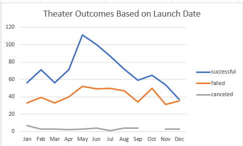
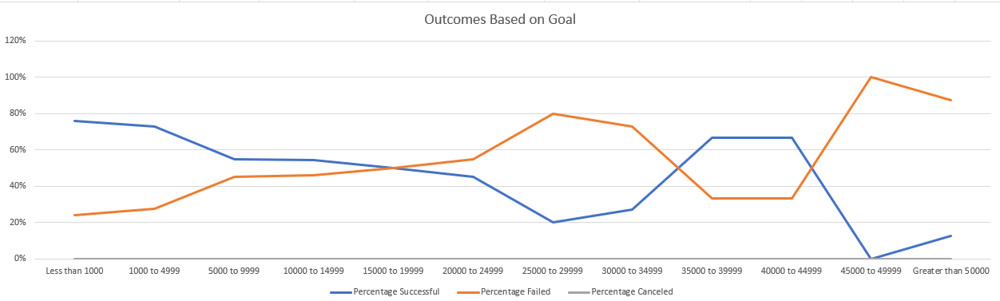

# Kickstarter Analysis of Theater Campaigns (2010 - 2017): Campaign Outcomes Based on Funding Goals and Campaign Launch Dates
-----
## OVERVIEW
Kickstarter data for theater campaigns from 2010 through 2017 has been analyzed to gain a greater understanding of campaigns from start to finish. The campaign outcomes (successful, failed, canceled) are evaluated based on funding goal amounts and campagin launch dates.

This data will be used to mirror future campaigns to previous successful ones in the same category. This will allow for more strategic use of resources and ultimately  more successful crowdfunding campaign outcomes.

-----
## TECHNOLOGIES
This analysis was conducted using Microsoft Excel. 

-----
## ANALYSIS AND CHALLENGES
To analyize the outcomes (successful, failed, canceled) based on launch date, the data was extracted to a pivot table and and filtered based on "Parent Category" and "Years." This allowed for the data to easily be viewed for the category "theater' and broken down by each month to see the total number of failed, successful, and canceled campaigns. A line chart was created to visually see the trends in theater campaign outcomes based on launch date.

To analyze the outcomes based on goals, the data was populated into a table with the following columns:

- Goal
- Number successful
- Number failed
- number canceled
- Total projects
- Percentage successful
- Percentage failed
- Percentage canceled

Using the table, a line chart was created to easily visualize the trends in outcomes based on goals.

-----
## ANALYSIS OF OUTCOMES BASED ON LAUNCH DATE
Crowdfunding campaigns for plays that begin in the months of May, June, and July have historically proven to be the most successful, with the successful outcomes being 111, 100, 87, respectfuly. Despite these months having the greatest number of successful campaigns, May, June, and July also had top the months for the most failed campaigns, with 52, 49 50 respectfully, as well as October, which also had 50 failed campaigns.

-----
## ANALYSIS OF OUTCOMES BASED ON GOALS
Crowdfunding campaign goals varied greatly, from less than $1,000 to greater than $50,000. The greatest percent of success was found for plays with goals up to $4,999 (71.66 - 75.81%). Trailing closely behind were campaigns with goals from $35,000 - $44,999 (66.67%).

Campaign goals that failed the most were those ranging from $45,000 and above, with less than 12.50% success rate.

-----
## CHALLENGES AND LIMITATIONS
Although this dataset provides useful information regarding outcomes based on fundraising goals and campaign start dates, to provide a more holistic analysis of what is required for a successful crowdfunding campaign, more information should be collected and analyzed. For example, knowing details about the marketing for each campaign, events and outreach, and the number of people involved in the campaigns would provide additional and useful data to include in the overal analysis of what makes a crowfunding campaign successful.

-----
## ADDITIONAL TABLES AND GRAPHS
In addition to the line charts, a box and whisker plot or bar graph would be additional options to visually interpret the data for crowdfunding campaign outcomes.
